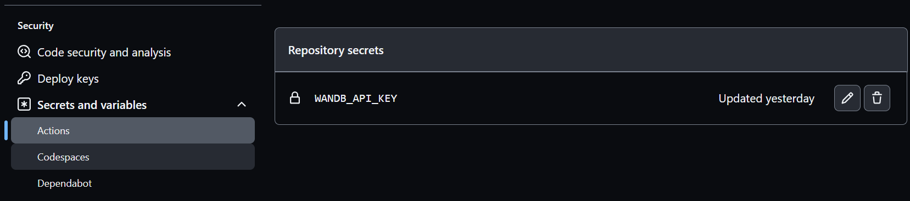

# WorkShop MLOps - PyCon 2023

This repository is a MLOps project that utilizes WandB to management the Machine Learning Lifecycle and GitHub Actions to orchestrate the different pipelines. The goal of this project is to provide a streamlined workflow for machine learning development, from data preparation to model deployment. WandB is used for experiment tracking and visualization, while GitHub Actions is used for continuous integration and deployment. With this setup, developers can easily track their experiments, collaborate with others, and deploy their models with confidence.

## References to check

> Databricks and MLFlow: [MLOps - End 2 end pipeline](https://notebooks.databricks.com/demos/mlops-end2end/index.html)
> MLOps in Azure Machine Learning [MLOps-V2](https://github.com/Azure/mlops-v2)


# Overview MLOps

Before we begin to understand what MLOps is, let's first review the process of developing a Machine Learning model.


Starting from the assumption that the data is already available to us, the steps we have are the following:

1. Data preparation: In this step, data cleaning is performed, missing data is removed, data is normalized, feature selection is performed, etc.
2. Model training: In this step, the model is trained with the training data.
3. Model packaging: In this step, the model is packaged for deployment.
4. Model evaluation: In this step, the model is evaluated with the test data.
5. Model deployment: In this step, the model is deployed for use.
6. Model monitoring: In this step, the model is monitored to detect changes in the model's behavior.

Now let's think about what happens if we want this model to be repeatable, scalable, that when there is a change in the model it can be retrained, that it can be deployed in different environments, that it can be monitored, etc. All these steps are part of the life cycle of a Machine Learning model.

Therefore, in order to automate this process, MLOps was created. Process in which we will be able to do the following:

1. Versioning the data: In this step we will be able to version the data so that when there is a change in the data, the model can be retrained.
2. Versioning the code: In this step we will be able to version the code so that when there is a change in the code, the model can be retrained.
3. Versioning the model: In this step we will be able to version the model so that when there is a change in the model, the model can be retrained.
4. Automate the deployment: In this step we will be able to automate the deployment of the model so that when there is a change in the model, the model can be redeployed.
5. Automate monitoring: In this step we will be able to automate the monitoring of the model so that when there is a change in the model, the model can be monitored again.

# What is MLOps ?

MLOps is a set of practices and tools that allow automating the life cycle of a Machine Learning model. In the following image, we see an example of an MLOps workflow:


> More info: [MLOps - End 2 end pipeline](https://www.dbdemos.ai/demo-notebooks.html?demoName=mlops-end2end)

As we can see, there are different roles involved in the MLOps process:

1. Data Scientist: This is the role responsible for data analysis, data preparation, model training, model evaluation, etc.
    - **_Data preparation and feature engineering_**
    - **_Building a model baseline_**
    - **_Promoting the best model for versioning_**

2. ML Engineer: This is the role responsible for automating the MLOps process.
    - **_Configuring webhooks or notifications_**
    - **_Automating model evaluation_**
    - **_Programming model retraining_**

3. Data Engineer: This is the role responsible for automating the ETL process.
    - **_Responsible for programming batch model inference execution_**

> Let's keep in mind that the Data Engineer, before this process, was the one in charge of carrying out the ETL process so that the data is available for the Data Scientist.

Now that we know what MLOps is, let's see how we can implement MLOps in our Machine Learning project.

# Tools for MLOps

## MLFlow

MLflow is a platform for streamlining machine learning development, including tracking experiments, packaging code into reproducible runs, and sharing and deploying models. MLflow offers a set of lightweight APIs that can be used with any existing machine learning application or library (TensorFlow, PyTorch, XGBoost, etc.), wherever you currently run ML code (e.g., in notebooks, standalone applications, or in the cloud). The current components of MLflow are:

## DVC

Data Version Control (DVC) is an open-source version control system used in machine learning projects. It is also known as Git for ML. It deals with data versions instead of code versions. DVC helps you handle large models and data files that cannot be handled with Git. It allows you to store information about different versions of your data to properly track ML data and access your model's performance later on. You can define a remote repository to send your data and models, ensuring easy collaboration among team members.

Data tracking is something necessary for any data science workflow. Still, it becomes difficult for data scientists to manage and track datasets. Therefore, there is a need to version data, which can be achieved using DVC. DVC is one of the convenient tools that can be used for your data science projects. These are some of the reasons to use DVC:

- It allows ML models to be reproducible and share results among the team.
- It helps manage the complexity of ML pipelines so you can train the same model repeatedly.
- It allows teams to maintain version files to quickly reference ML models and their results.
- It has all the power of Git branches.
- Sometimes team members get confused if datasets are mislabeled according to convention; DVC helps label datasets correctly.
- Users can work on desktops, laptops with GPUs, and cloud resources if they need more memory.

## MLFlow

MLflow is a platform for streamlining machine learning development, including tracking experiments, packaging code into reproducible runs, and sharing and deploying models. MLflow offers a set of lightweight APIs that can be used with any existing machine learning application or library (TensorFlow, PyTorch, XGBoost, etc.), wherever you currently run ML code (e.g., in notebooks, standalone applications, or in the cloud). The current components of MLflow are:

- MLflow Tracking: an API for logging parameters, code, and results in machine learning experiments and comparing them using an interactive user interface.
- MLflow Projects: a packaging format for reproducible runs using Conda and Docker, so you can share your ML code with others.
- MLflow Models: a packaging format for models and tools that let you easily deploy the same model (from any ML library) for batch and real-time scoring on platforms like Docker, Apache Spark, Azure ML, and AWS SageMaker.
- MLflow Model Registry: a centralized model store, a set of APIs, and a UI for collaboratively managing the full lifecycle of MLflow models.

For more information about MLFlow, you can visit the following link: [https://mlflow.org/](https://mlflow.org/)

## DVC

Data Version Control (DVC) is an open-source version control system used in machine learning projects. It is also known as Git for ML. It deals with data versions instead of code versions. DVC helps you handle large models and data files that cannot be handled with Git. It allows you to store information about different versions of your data to properly track ML data and access your model's performance later on. You can define a remote repository to send your data and models, ensuring easy collaboration among team members.

Data tracking is something necessary for any data science workflow. Still, it becomes difficult for data scientists to manage and track datasets. Therefore, there is a need to version data, which can be achieved using DVC. DVC is one of the convenient tools that can be used for your data science projects. These are some of the reasons to use DVC:

- It allows ML models to be reproducible and share results among the team.
- It helps manage the complexity of ML pipelines so you can train the same model repeatedly.
- It allows teams to maintain version files to quickly reference ML models and their results.
- It has all the power of Git branches.
- Sometimes team members get confused if datasets are mislabeled according to convention; DVC helps label datasets correctly.
- Users can work on desktops, laptops with GPUs, and cloud resources if they need more memory.
- Its goal is to exclude the need for spreadsheets, ad hoc tools, and scripts for sharing documents for communication.
- The push/pull commands are used to move consistent packages of models, data, and ML code to production, remote machines, or a colleague's team.

For more information about DVC, you can visit the following link: [https://dvc.org/](https://dvc.org/)

Article that talks about MLFlow vs DVC: [https://censius.ai/blogs/dvc-vs-mlflow](https://censius.ai/blogs/dvc-vs-mlflow)

## Dvclive

DVCLive is a Python library for logging machine learning metrics and other metadata in simple file formats, which is fully compatible with DVC.

For more information about DVCLive, you can visit the following link: [https://dvc.org/doc/dvclive](https://dvc.org/doc/dvclive)

## Weight and Bias

Weight and Bias (wandb) is a machine learning operations (MLOps) tool that helps data scientists track and visualize their machine learning experiments. It allows users to log and track metrics, hyperparameters, and artifacts from their machine learning models. With wandb, data scientists can easily compare and analyze different experiments, collaborate with team members, and share their results with others. It also provides a dashboard that displays real-time metrics and visualizations, making it easier to monitor the performance of machine learning models. Overall, wandb is a powerful tool that can help data scientists streamline their machine learning workflows and improve the reproducibility of their experiments.

More Information in this [link](https://docs.wandb.ai/)

## Github Actions

GitHub Actions is a powerful DevOps tool that allows developers to automate their workflows and streamline their software development processes. With GitHub Actions, developers can create custom workflows that automatically build, test, and deploy their code to various environments. This tool integrates seamlessly with GitHub repositories, making it easy to manage and track changes to code. GitHub Actions also provides a wide range of pre-built actions that can be used to automate common tasks, such as running tests, deploying to cloud platforms, and sending notifications. Overall, GitHub Actions is a valuable tool for any software development team looking to improve their DevOps practices and increase their productivity.

More Information in this [link](https://docs.github.com/en/actions)

# Hands-on Lab

Now we will star our lab, this will be the process that we will deploy:

 

 1. First create an account in [wandb](https://wandb.ai/)
 2. Fork this [repo](https://github.com/darkanita/MLOps_wsPycon2023.git) in your github account.
 3. Configure secret to actions name it as WANDB_API_KEY

4. To test local it is necessary login in the terminal, then execute:
```bash
wandb login
```
You need to have the token.
        

> **Note:** If you find this repository usefull give me a :star:, It makes me very happy :smiley: and it could be a motivation to create more content like this! :muscle:
